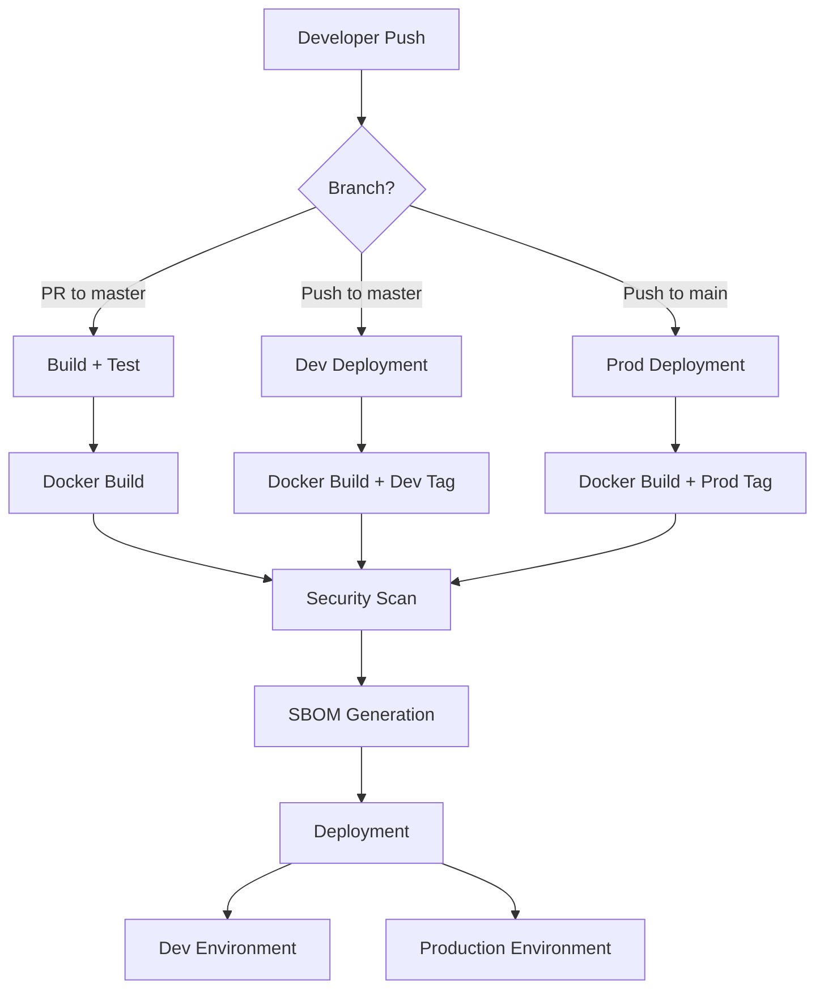

# 🚀 Gigsy Enterprise CI/CD & Deployment Strategy

## 📋 Overview

This document outlines the comprehensive CI/CD and deployment strategy for **Gigsy**, implementing industry-leading DevOps practices with Docker containerization, immutable deployments, and enterprise-grade security.

## 🏗️ Architecture Overview



## 🐳 Docker Image Tagging Strategy

### Repository Configuration
- **Docker Registry**: `docker.io`
- **Repository**: `mostafayaser/gigsy_digitopia2025`
- **Multi-Platform Support**: `linux/amd64`, `linux/arm64`

### Tagging Schema

| Tag Type | Format | Example | Usage | Lifecycle |
|----------|--------|---------|-------|-----------|
| **Immutable Commit** | `:<commit-sha-7>` | `:a1b2c3d` | All deployments | Permanent |
| **Development Pointer** | `:dev` | `:dev` | Latest master build | Overwritten |
| **Production Pointer** | `:prod` | `:prod` | Latest main build | Overwritten |
| **Pull Request** | `:pr-<number>` | `:pr-123` | QA testing | Temporary |

### Key Principles
- ✅ **Immutability**: All deployments use `:<commit-sha-7>` for traceability
- ✅ **Convenience**: `:dev` and `:prod` provide quick access to latest builds
- ✅ **Efficiency**: Single build per commit with multi-tagging
- ✅ **Security**: Every image scanned before deployment

## 🔄 Workflow Triggers & Behaviors

### 1. Pull Request to `master`
```yaml
Trigger: pull_request → master
Purpose: Validation and QA
Actions:
  ✅ Build Docker image with :commit-sha
  ✅ Run complete test suite (Jest, ESLint, TypeScript)
  ✅ Security scanning and vulnerability assessment
  ✅ Optional :pr-<number> tag for QA environments
  ❌ No deployment to persistent environments
```

### 2. Push/Merge to `master` (Development)
```yaml
Trigger: push → master
Purpose: Development deployment
Actions:
  ✅ Build Docker image with :commit-sha
  ✅ Tag as :dev (mutable pointer)
  ✅ Deploy to development environment using :commit-sha
  ✅ Update development environment
  ✅ SBOM generation and artifact storage
```

### 3. Push/Merge to `main` (Production)
```yaml
Trigger: push → main
Purpose: Production deployment
Actions:
  ✅ Build Docker image with :commit-sha
  ✅ Tag as :prod (mutable pointer)
  ✅ Enhanced security scanning
  ✅ Deploy to production environment using :commit-sha
  ✅ Manual approval gates for production
  ✅ Extended SBOM retention (90 days)
```

## 🔒 Security & Compliance

### Multi-Layer Security Approach

#### 1. Source Code Security
- **Dependency Review**: Automated scan for vulnerable dependencies
- **SAST Scanning**: CodeQL integration for static analysis
- **Supply Chain Security**: Dependency provenance verification

#### 2. Container Security
- **Trivy Scanning**: Vulnerability assessment for all built images
- **SBOM Generation**: Software Bill of Materials for compliance
- **Base Image Security**: Minimal Alpine-based images
- **Non-Root Execution**: Containers run as unprivileged user

#### 3. Runtime Security
- **Image Signing**: Digital signatures for image authenticity
- **Registry Security**: Private registry with access controls
- **Network Policies**: Kubernetes network segmentation
- **Resource Limits**: CPU and memory constraints

### Compliance Features
- **SARIF Reports**: Security findings uploaded to GitHub Security tab
- **Audit Trails**: Complete build and deployment history
- **Retention Policies**: Artifacts retained per compliance requirements
- **Access Controls**: Role-based permissions for deployments

## 🌍 Environment Strategy

### Development Environment
- **URL**: `https://dev-gigsy.digitopia.com`
- **Purpose**: Feature testing and integration validation
- **Auto-Deploy**: From `master` branch
- **Image Tag**: Always uses `:commit-sha` for consistency
- **Data**: Synthetic test data, safe for experimentation

### Staging Environment (Future)
- **URL**: `https://staging-gigsy.digitopia.com`
- **Purpose**: Pre-production validation
- **Deploy**: Manual trigger or automated from `master`
- **Data**: Production-like data (sanitized)

### Production Environment
- **URL**: `https://gigsy.digitopia.com`
- **Purpose**: Live user-facing application
- **Auto-Deploy**: From `main` branch with approval gates
- **Image Tag**: Always uses `:commit-sha` for rollback capability
- **Data**: Live production data with full backups

## 📊 Monitoring & Observability

### Build Metrics
- **Build Duration**: Track CI/CD pipeline performance
- **Test Coverage**: Maintain >80% code coverage
- **Security Scan Results**: Zero critical vulnerabilities policy
- **Image Size Tracking**: Monitor container bloat

### Deployment Metrics
- **Deployment Frequency**: Track release velocity
- **Lead Time**: Code commit to production deployment
- **Mean Time to Recovery (MTTR)**: Incident response speed
- **Change Failure Rate**: Percentage of deployments causing issues

### Application Metrics
- **Health Checks**: Kubernetes liveness and readiness probes
- **Performance Monitoring**: Response time and throughput
- **Error Tracking**: Application error rates and patterns
- **Resource Usage**: CPU, memory, and storage utilization

## 🛠️ Deployment Commands

### Quick Start Commands

#### Pull Latest Development Image
```bash
# Using mutable pointer (convenience)
docker pull mostafayaser/gigsy_digitopia2025:dev

# Using immutable tag (recommended for deployments)
docker pull mostafayaser/gigsy_digitopia2025:a1b2c3d
```

#### Run Locally
```bash
# Development image
docker run -p 3000:3000 mostafayaser/gigsy_digitopia2025:dev

# Specific commit (production-like)
docker run -p 3000:3000 mostafayaser/gigsy_digitopia2025:a1b2c3d
```

#### Docker Compose Integration
```yaml
version: '3.8'
services:
  gigsy:
    image: mostafayaser/gigsy_digitopia2025:a1b2c3d  # Always use commit SHA
    ports:
      - "3000:3000"
    environment:
      - NODE_ENV=production
    restart: unless-stopped
    healthcheck:
      test: ["CMD", "node", "healthcheck.js"]
      interval: 30s
      timeout: 3s
      retries: 3
```

### Kubernetes Deployment Commands

#### Development Deployment
```bash
# Deploy specific commit
kubectl set image deployment/gigsy-dev gigsy=mostafayaser/gigsy_digitopia2025:a1b2c3d

# Verify deployment
kubectl rollout status deployment/gigsy-dev
```

#### Production Deployment
```bash
# Deploy with approval
kubectl set image deployment/gigsy-prod gigsy=mostafayaser/gigsy_digitopia2025:a1b2c3d

# Verify rollout
kubectl rollout status deployment/gigsy-prod

# Rollback if needed (to previous commit)
kubectl rollout undo deployment/gigsy-prod
```

#### Helm Chart Deployment
```bash
# Development
helm upgrade gigsy-dev ./helm-charts/gigsy \
  --set image.tag=a1b2c3d \
  --set environment=development

# Production
helm upgrade gigsy-prod ./helm-charts/gigsy \
  --set image.tag=a1b2c3d \
  --set environment=production \
  --wait --timeout=600s
```

## 🔧 Development Workflow

### Local Development Setup
```bash
# Clone repository
git clone https://github.com/mostafayaser/gigsy_digitopia2025.git
cd gigsy

# Install dependencies
pnpm install

# Run development server
pnpm dev

# Run tests
pnpm test

# Build for production
pnpm build
```

### Feature Development Process
1. **Create Feature Branch**: `git checkout -b feature/new-feature`
2. **Develop & Test**: Local development with hot reload
3. **Commit Changes**: Following conventional commit standards
4. **Create Pull Request**: Target `master` branch
5. **CI/CD Validation**: Automated testing and security scanning
6. **Code Review**: Team review and approval
7. **Merge to Master**: Automatic development deployment
8. **Promote to Main**: Production deployment after validation

### Rollback Procedures

#### Quick Rollback (Last Deployment)
```bash
# Kubernetes
kubectl rollout undo deployment/gigsy-prod

# Docker Compose (manual tag update)
# Update docker-compose.yml with previous commit SHA
docker-compose up -d
```

#### Targeted Rollback (Specific Commit)
```bash
# Find previous successful commit
git log --oneline main

# Deploy specific commit
kubectl set image deployment/gigsy-prod gigsy=mostafayaser/gigsy_digitopia2025:xyz9876
```

## 📈 Performance Optimization

### Build Optimization
- **Docker Layer Caching**: GitHub Actions cache for faster builds
- **Multi-Stage Builds**: Separate build and runtime environments
- **Dependency Caching**: pnpm cache for node_modules
- **Parallel Builds**: Multi-platform builds using BuildKit

### Image Optimization
- **Alpine Base Images**: Minimal attack surface and size
- **Multi-Architecture**: ARM64 and AMD64 support
- **Compression**: Optimized layer compression
- **Security Scanning**: Automated vulnerability detection

### Deployment Optimization
- **Health Checks**: Fast startup and readiness detection
- **Resource Limits**: Appropriate CPU and memory allocation
- **Horizontal Scaling**: Kubernetes HPA for traffic spikes
- **Blue-Green Deployments**: Zero-downtime updates

## 🚨 Troubleshooting Guide

### Common Issues and Solutions

#### Build Failures
```bash
# Check workflow logs
gh run list
gh run view <run-id>

# Local build debugging
docker build -t test-build .
docker run --rm test-build
```

#### Deployment Issues
```bash
# Check pod status
kubectl get pods -l app=gigsy

# Check pod logs
kubectl logs -l app=gigsy --tail=100

# Debug container
kubectl exec -it <pod-name> -- /bin/sh
```

#### Image Pull Errors
```bash
# Verify image exists
docker manifest inspect mostafayaser/gigsy_digitopia2025:a1b2c3d

# Check authentication
docker login docker.io

# Pull manually
docker pull mostafayaser/gigsy_digitopia2025:a1b2c3d
```

### Emergency Procedures

#### Production Incident Response
1. **Immediate**: Check application health and error rates
2. **Rollback**: Deploy last known good commit SHA
3. **Investigate**: Review logs and metrics
4. **Fix**: Develop hotfix in separate branch
5. **Deploy**: Fast-track hotfix through reduced pipeline
6. **Post-Mortem**: Document lessons learned

#### Security Incident Response
1. **Isolate**: Stop affected deployments
2. **Assess**: Review security scan results
3. **Patch**: Update vulnerable dependencies
4. **Rebuild**: Create new secure image
5. **Redeploy**: Update all environments
6. **Monitor**: Enhanced security monitoring

## 📚 Additional Resources

### Documentation
- [GitHub Actions Workflow](./.github/workflows/ci-cd-docker-enterprise.yml)
- [Docker Best Practices](./DOCKER_README.md)
- [Kubernetes Manifests](./k8s/)
- [Helm Charts](./helm-charts/)

### Monitoring Dashboards
- **GitHub Actions**: Pipeline execution and metrics
- **Docker Hub**: Image registry and pull statistics
- **Kubernetes Dashboard**: Deployment and pod status
- **Application Monitoring**: Performance and error tracking

### Security Resources
- **GitHub Security Tab**: Vulnerability reports and SARIF results
- **Docker Security**: Image scanning and compliance reports
- **SBOM Artifacts**: Software bill of materials for auditing
- **Compliance Reports**: Automated compliance validation

---

## ✅ Implementation Checklist

### Initial Setup
- [ ] Configure Docker Hub secrets (`DOCKERHUB_USERNAME`, `DOCKERHUB_TOKEN`)
- [ ] Set up GitHub environments (development, production)
- [ ] Configure branch protection rules
- [ ] Set up monitoring and alerting

### Security Configuration
- [ ] Enable GitHub Security tab
- [ ] Configure vulnerability alerts
- [ ] Set up SBOM retention policies
- [ ] Implement image signing (future)

### Deployment Infrastructure
- [ ] Set up Kubernetes clusters (dev, prod)
- [ ] Configure ingress controllers
- [ ] Set up monitoring stack
- [ ] Implement backup strategies

### Testing & Validation
- [ ] Validate complete CI/CD pipeline
- [ ] Test rollback procedures
- [ ] Verify security scanning
- [ ] Load test deployments

---

**🎯 Result**: A production-ready, enterprise-grade CI/CD pipeline ensuring secure, traceable, and efficient deployments for the Gigsy platform.
