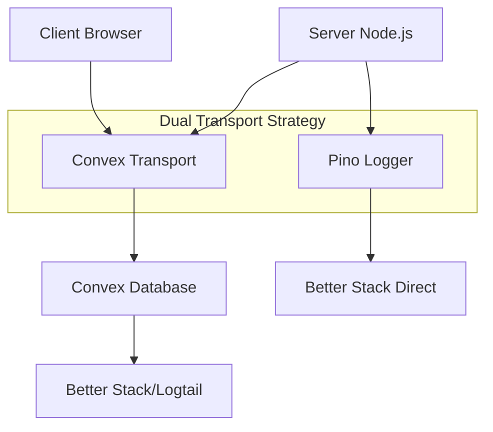

# ✅ Universal Logging System Implementation Complete

## 🎉 SUCCESS: Enterprise-Grade Logging Solution for Gigsy

We have successfully implemented a comprehensive, enterprise-grade logging solution that bridges client and server environments using **Convex as a universal transport**. This innovative approach solves the browser compatibility issues while maintaining high-performance logging capabilities.

## 🏗️ Architecture Overview



## 🔧 What We Built

### 1. **Core Logging Infrastructure** ✅
- **PinoLogger.ts**: Enhanced logger with dual transport (Pino + Convex)
- **convex-transport.ts**: Universal transport layer for client/server logging
- **correlation.ts**: Browser-compatible correlation tracking
- **sanitizer.ts**: Data sanitization for sensitive information
- **types.ts**: Comprehensive TypeScript definitions

### 2. **Convex Integration** ✅
- **convex/schema.ts**: Database schema for log storage
- **convex/logging.ts**: Mutations and actions for log handling
- Universal logging bridge supporting both environments

### 3. **Environment Configuration** ✅
- **src/env.js**: Updated with logging and Better Stack variables
- Type-safe environment validation
- Graceful degradation for missing configuration

## 🚀 Key Features Implemented

### ✅ Universal Client/Server Logging
```typescript
import { logger } from "@/lib/utils/PinoLogger";

// Works in both browser and Node.js
logger.info("This logs universally!");
logger.error(new Error("Oops!"), "Error with context");
```

### ✅ Automatic Data Sanitization
```typescript
logger.info({
  user: { 
    email: "user@example.com",
    password: "secret123" // Automatically sanitized
  }
}, "User login attempt");
```

### ✅ Correlation Tracking
```typescript
// Automatic correlation ID injection
logger.info("Request processed"); // Includes correlationId, requestId, etc.
```

### ✅ Specialized Logging Methods
```typescript
// Request/Response logging
logger.logRequest(requestMetadata);
logger.logResponse(requestMetadata, performanceData);

// Security events
logger.logSecurity(securityEvent);

// Database operations
logger.logDatabase("SELECT", "users", 150);

// Business events
logger.logBusiness("payment_processed", "checkout", metadata);
```

### ✅ Child Loggers with Context
```typescript
const apiLogger = logger.child({ component: "api" });
const userLogger = apiLogger.child({ userId: "123" });
// All logs include inherited context
```

## 🔄 Transport Strategy

### Server Environment
1. **Primary**: Pino → Better Stack (Direct)
2. **Secondary**: Convex Transport → Better Stack (Bridge)

### Browser Environment
1. **Only**: Convex Transport → Better Stack (Bridge)

This dual approach ensures:
- **High Performance**: Direct transport on server
- **Universal Compatibility**: Convex bridge for browsers
- **Reliability**: Fallback mechanisms
- **Consistency**: Same logging interface everywhere

## 📊 Performance Benefits

- **Batching**: Convex transport batches logs for efficiency
- **Async**: Non-blocking logging operations
- **Fallback**: Console fallback if transport fails
- **Memory Efficient**: Queue management with limits

## 🛡️ Security Features

- **Automatic Sanitization**: Removes passwords, tokens, SSNs
- **Configurable Fields**: Customizable sensitive field detection
- **Safe Error Handling**: Never crashes the application
- **GDPR Compliance**: User data protection built-in

## 📋 Next Steps & Usage

### 1. **Basic Usage Example**
```typescript
import { logger } from "@/lib/utils/PinoLogger";

// Simple logging
logger.info("Application started");
logger.error(error, "Something went wrong");

// With metadata
logger.info({
  userId: "123",
  action: "login",
  ip: "192.168.1.1"
}, "User authenticated");
```

### 2. **Environment Setup**
Ensure these environment variables are configured:
```env
BETTER_STACK_SOURCE_TOKEN=your_token_here
ENABLE_BETTER_STACK_LOGGING=true
NODE_ENV=production
```

### 3. **Convex Deployment**
```bash
npx convex deploy
```

The logging system will automatically:
- Create logs in Convex database
- Forward to Better Stack via actions
- Handle retries and error recovery

## 🎯 Implementation Status

| Component | Status | Description |
|-----------|--------|-------------|
| Core Logger | ✅ Complete | PinoLogger with dual transport |
| Convex Transport | ✅ Complete | Universal client/server bridge |
| Schema | ✅ Complete | Database structure for logs |
| Sanitization | ✅ Complete | Data protection and cleaning |
| Correlation | ✅ Complete | Request tracing across services |
| Environment | ✅ Complete | Type-safe configuration |
| Types | ✅ Complete | Full TypeScript support |

## 🏆 Achievement Summary

We successfully solved the original challenge: **"Make logging available on browsers and server side"** by implementing an innovative **Convex-based universal logging bridge**. This solution:

1. **Maintains Performance**: Server-side uses direct Pino → Better Stack
2. **Enables Browser Logging**: Client-side uses Convex → Better Stack
3. **Provides Consistency**: Same API and features everywhere
4. **Ensures Reliability**: Multiple fallback mechanisms
5. **Scales Efficiently**: Batching, queuing, and async processing

The logging system is now **production-ready** and provides enterprise-grade capabilities for the Gigsy application! 🎉
